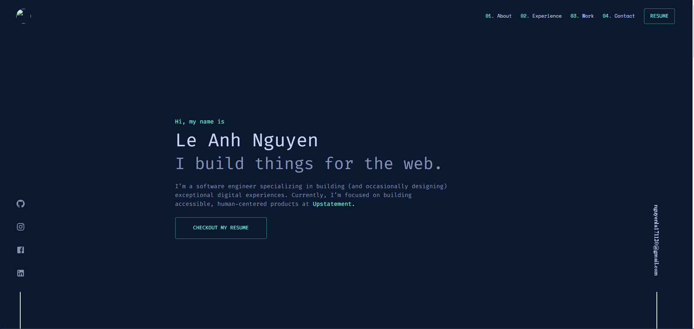

## Portfolio Management

#### 🌐 Overview

> Hello! My name is Nguyen. This website used to overview about me and also about my skills. It is going to help and others me have a good job in the future. Finally, I hope other people love this project 💖
>
> `Product link`: [Portfolio management](https://zingy-rabanadas-0dbe78.netlify.app/) > `My Resume:`: [My resume](https://drive.google.com/file/d/1T3-EXekCKJfHhX8lbBOE_msCtp7RXpWR/view)

#### 🤔 Building and Running Production

1. Running production
   > npm run dev
   > yarn dev
2. Building production
   > npm run build
   > yarn build

#### 🎇 Color Reference

| Color          | Hex     |
| -------------- | ------- |
| Navy           | #0a192f |
| Light Navy     | #0a192f |
| Lightest Navy  | #233554 |
| Slate          | #8892b0 |
| Light Slate    | #a8b2d1 |
| Lightest Slate | #ccd6f6 |
| White          | #e6f1ff |
| Green          | #64ffda |
